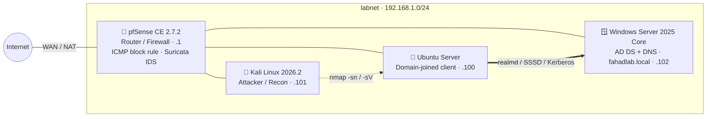

<!-- Header -->
<p align="center">
  
</p>

<p align="center">
  <a href="https://git.io/typing-svg">
    
  </a>
</p>

<p align="center">
  <a href="https://www.linkedin.com/in/syed-fahad-quadri-8a796a3a8/"></a>
  <a href="https://fahad-quadri.github.io/"></a>
  <a href="mailto:syedfahadquadri09@gmail.com"></a>
  
</p>

---

### `> cat about.txt`

```yaml
analyst:
  name:      Syed Fahad Quadri
  role:      Security Analyst — SOC / Incident Response / Vulnerability Management
  based_in:  Kansas City, MO (open to relocation)
  focus:     [alert triage, phishing & BEC investigation, vuln assessment, packet analysis]
  sectors:   [healthcare (HIPAA), multi-tenant client environments]
  education: M.S. Cybersecurity Management — Lindsey Wilson University
  certs:
    - Google Cybersecurity Professional Certificate  # completed
    - CompTIA Security+                              # exam scheduled Sep 2026
  status:    open to SOC Analyst / Security Analyst roles
```

---

### 📈 Impact at a Glance

<table align="center">
  <tr>
    <td align="center" width="25%"><h2>50+</h2><sub>Splunk SIEM alerts<br/>triaged daily</sub></td>
    <td align="center" width="25%"><h2>150+</h2><sub>Windows &amp; Linux systems<br/>scanned (Nessus / OpenVAS)</sub></td>
    <td align="center" width="25%"><h2>25+</h2><sub>critical &amp; high-risk<br/>findings prioritized</sub></td>
    <td align="center" width="25%"><h2>8+</h2><sub>confirmed compromises<br/>escalated</sub></td>
  </tr>
</table>

---

### 🛡️ Experience & Education

| Role | Organization | Dates | Highlights |
|---|---|---|---|
| **SOC Analyst Intern** | Unify Decoders LLC | Jan 2026 – Aug 2026 | 40+ daily Splunk alerts with SOP-based triage · 60+ systems evaluated, 25+ critical/high findings prioritized · Wireshark/Nmap validation of IDS/IPS indicators, 8+ compromises escalated |
| 🎓 **M.S. Cybersecurity Management** | Lindsey Wilson University | Jan 2024 – Dec 2025 | Graduate study in cybersecurity management between the HHC Clinic role and the Unify Decoders internship |
| **Security Analyst** | HHC Clinic | Aug 2022 – Nov 2023 | 50+ daily SIEM alerts in healthcare · phishing & BEC investigation with audit-ready evidence · 150+ systems scanned for HIPAA readiness · PCI DSS / ISO policy documentation |
| **Cybersecurity Intern** | AICTE | Jan 2022 – Jun 2022 | Hybrid Azure / AWS / GCP configuration · segmentation, identity controls & logging · change-control docs with Terraform & PowerShell |

---

### 🔬 Featured Lab — [Home-lab-network-security](https://github.com/Fahad-Quadri/Home-lab-network-security)

> A virtualized enterprise-in-a-box: firewall, attacker, Linux client and an Active Directory domain — every build step, failure, and root cause documented with screenshots.



| What I built | What I troubleshot |
|---|---|
| pfSense router/firewall with isolated LAN segment and verified NAT routing | VT-x capture by Windows VBS/Memory Integrity, APIC panic, ZFS pager-read boot loop |
| LAN ICMP-block rule, verified with before/after ping tests | Suricata `ipfw` divert-socket failure — 4 start paths tested, root-caused to the VM NIC |
| Kali recon: host discovery + service/version scans | `.local` DNS resolution quirk in `systemd-resolved` blocking `realm discover` |
| Windows Server 2025 DC via PowerShell (`Install-ADDSForest`) | Kerberos preauthentication failure during the Linux domain join |

---

### 🗂️ More Projects

<table>
  <tr>
    <td width="33%" valign="top">
      <h4><a href="https://github.com/Fahad-Quadri/ioc-extractor">🔎 ioc-extractor</a></h4>
      Python CLI that pulls IPs, domains, URLs, emails, hashes and CVEs out of phishing emails and SIEM alerts, refangs/defangs, exports CSV/JSON for Splunk lookups.<br/><br/>
      <code>Python</code> <code>unit-tested</code> <code>GitHub Actions</code>
    </td>
    <td width="33%" valign="top">
      <h4><a href="https://github.com/Fahad-Quadri/splunk-detection-library">📡 splunk-detection-library</a></h4>
      8 SPL detections (brute force, password spraying, encoded PowerShell, log clearing, DNS tunneling…) mapped to MITRE ATT&amp;CK, each with tuning and triage steps.<br/><br/>
      <code>Splunk SPL</code> <code>Sysmon</code> <code>ATT&amp;CK</code>
    </td>
    <td width="33%" valign="top">
      <h4><a href="https://github.com/Fahad-Quadri/phishing-analysis-playbook">🎣 phishing-analysis-playbook</a></h4>
      End-to-end phishing &amp; BEC investigation method: evidence handling, SPF/DKIM/DMARC header analysis, scoping, containment, and an incident report template.<br/><br/>
      <code>IR</code> <code>BEC</code> <code>HIPAA-aware</code>
    </td>
  </tr>
</table>

---

### 🧰 Toolkit

**SIEM · EDR · Detection**
<p>
  
  
  
  
  
  
  
</p>

**Network & Vulnerability**
<p>
  
  
  
  
  
  
  
  
</p>

**Cloud · Systems · Identity**
<p>
  
  
  
  
  
  
  
</p>

**Scripting**
<p>
  
  
  
  
</p>

**Governance & Compliance** &nbsp;·&nbsp; `HIPAA` `PCI DSS` `ISO` `CIS Controls` `Security Policy` `Incident Documentation`

---

### 🎯 Currently

- 📘 Preparing for **CompTIA Security+** (exam scheduled September 2026)
- 🧪 Extending the home lab — next up: getting an IDS sensor running on a different virtual NIC / hypervisor, and alternatives like Snort
- 🔎 Practicing attacker TTPs mapped to **MITRE ATT&CK** on Hack The Box
- 💼 Open to **SOC Analyst / Security Analyst** roles — happy to relocate

<p align="center">
  
</p>
